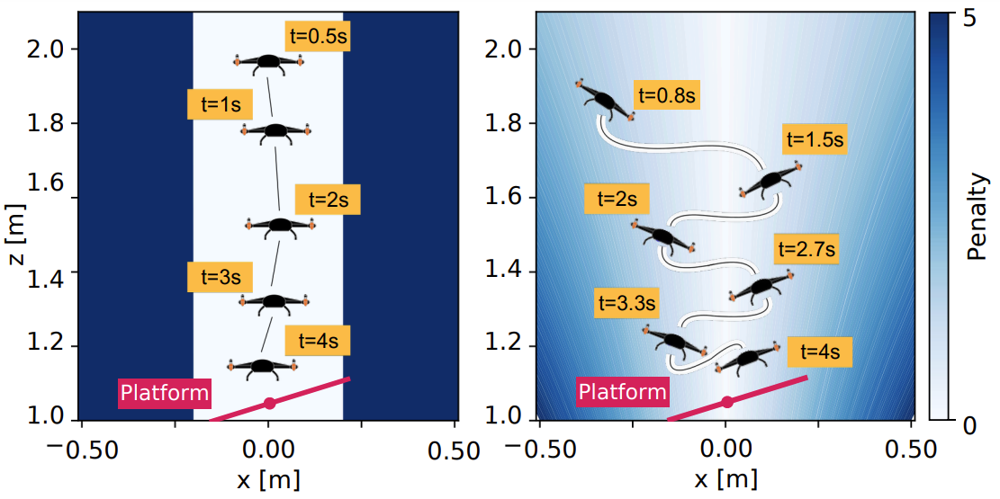
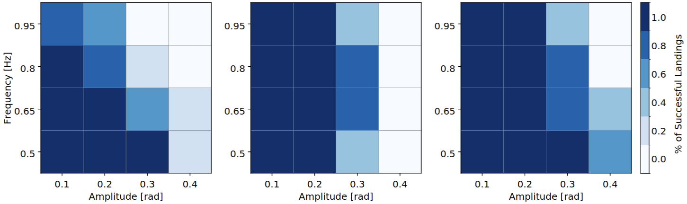
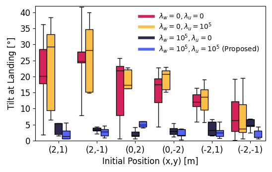
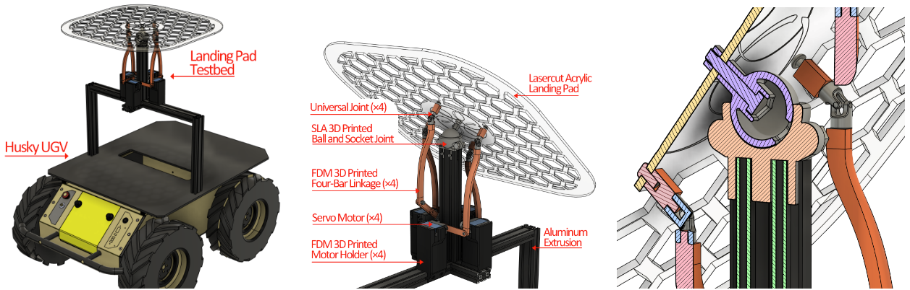
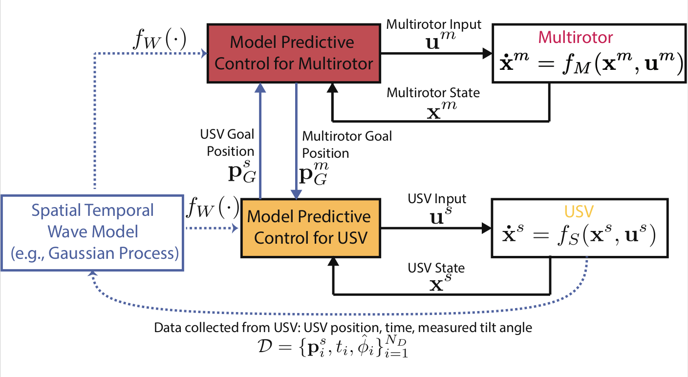
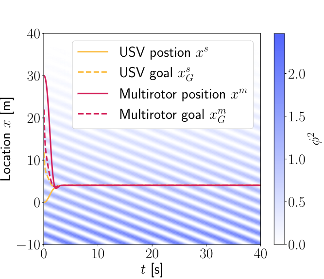
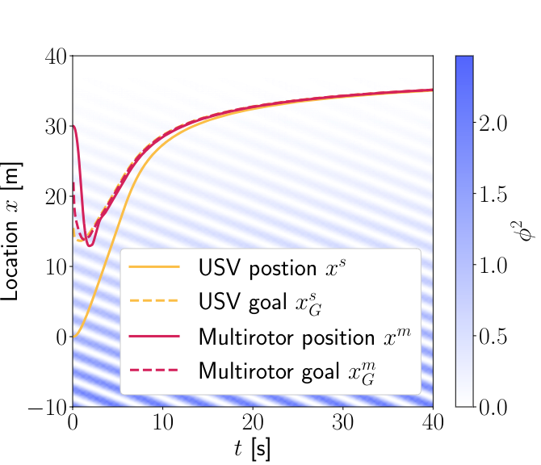
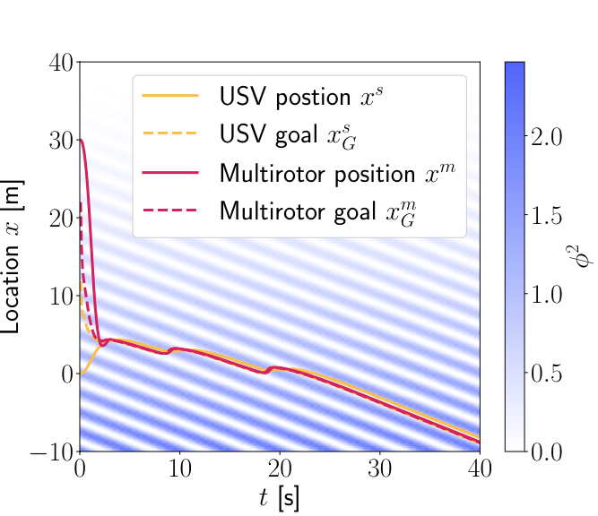

Welcome to the UAV-USV Landing project! This page covers the progress made on this project to date by members of [Robora Lab](https://roboralab.com/).

---
### Background
Autonomous teams of multirotors and uncrewed surface vessels (USVs) are invaluable to challenging maritime applications, including remote monitoring, search-and-rescue, and surveillance [1], [2], [3]. After deployment in a remote setting, the functional life of the system is ultimately limited by the battery-life of the multirotor. The research that we continue to investigate in this project is the ability to autonomously land a multirotor on a USV for recharging. We address this problem with safe control algorithms and apply control schemes in simulation, testbed validation, and real-world experiments.

Operating in unknown and variable marine conditions, USVs are subject to complex wave-induced motions that include effects on pitch, roll, yaw, sway, surge, and heave [4]. To prevent damage to the multirotor due to severe motion in these degrees of freedom, it must perform a safe and controlled landing [5]. In a robust landing solution, we must consider the variability of the amplitude and frequency of waves due to changing meteorological conditions. We leverage the Great Lakes Coastal Forecasting System to define the range of waves in which our system should succeed.

Contributions of the project are listed below from newest to oldest.

---
### Benchmarking Model Predictive Control Strategies for Multirotor Landing on a Dynamically Tilting Platform [Winter 2025]
##### Accepted to the workshop '25 Years of Aerial Robotics: Challenges and Opportunities' hosted at the 2025 International Conference on Robotics and Automation (ICRA)

In prior work, we assume that there is a local region with calm waves that can be reached by both vehicles to then perform a safe landing. In practical scenarios, spatial-temporal assumptions are not realistic if an emergency landing is necessary or if time and resources are constrained. Recognizing that robust multirotor landing on a USV requires safe landing in waves of varying severity, we benchmark the robustness of three different quadratic MPC strategies for landing on the tilting testbed under various frequency (0.5-0.95 Hz) and amplitude (0.1-0.4 rad) conditions.

The three strategies are **"Track Position"**, **"Match Rotation"**, and **"Combination"**.

In these strategies we include optimization costs that weigh position, attitude, and altitude errors between the multirotor and the platform. Though all strategies successfully land in low-frequency, low-amplitude conditions, they have low success in the higher-amplitude conditions. In this work, we conclude that quadratic MPC cost is not robust to the range of frequencies and amplitudes required for landing in waves.



  <figure style="text-align: center; width: 60%; margin: 0 auto;">
    
    <figcaption style="width: 100%; margin: 8px auto 0 auto; font-style: italic; color: #555;">
      Two multirotor paths using two different MPC strategies. On the left the "Track Position" strategy guides the multirotor to the center of the platform where it lands with a significant rotational error. On the right the "Combination" strategy reduces the rotational error but introduces positional error as the multirotor translates to match the rotation of the platform.
    </figcaption>
  </figure>

<figure style="flex: 1; min-width: 250px; text-align: center;">
  
  <figcaption style="width: 80%; margin: 8px auto 0 auto; font-style: italic; color: #555;">
    Experimental landing success rates of the three MPC strategies. "Track Position" (left), "Match Rotation" (center), "Combination" (right).
  </figcaption>
</figure>



---
### A Time and Place to Land: Online Learning-Based Distributed MPC for Multirotor Landing on Surface Vessel in Waves [Summer 2024]
##### Accepted as a contributing paper at the 2025 International Conference on Unmanned Aircraft Systems (ICUAS). Check out the paper [here](https://arxiv.org/abs/2410.21674)!
We addressed two limitations of our prior solution in this work. The assumption that a spatial-temporal wave model was perfectly known is not reasonable for practical landing scenarios. In this work we learn the spatial-temporal local wave model from data as a Gaussian Process (GP). The mean and uncertainty quantification from the GP regression are incorporated into our previous distributed MPC framework to enable safer landings in uncertain wave conditions. Another limitation of our prior solution is that it was validated only in simulation. Due to the cost of surface vessels and lack of suitable geographic testing locations, many UAV-USV cooperative landing solutions are similarly bound to simulation. To address this limitation, we built a low-cost testbed platform mounted on an unmanned ground vehicle to mimic the spatial-temporal tilting motion of a USV in waves. Using a Bitcraze Crazyflie 2.1 UAV, and a ClearPath Robotics Husky mounted with our tilting platform, we performed substantial experimental validation of our proposed framework in harsh wave conditions. Our proposed framework achieved a 53% landing success rate improvement over an approach that neglects spatial-temporal tilt motion.


<!-- Top Row: Image + Video Side by Side -->

  <!-- Figure 1 Image -->
  <figure style="flex: 1; min-width: 300px; text-align: center;">
    
    <figcaption style="margin-top: 8px; font-style: italic; color: #555;">
      Tilt of the platform at landing in harsh wave conditions. Our proposed approach (blue) achieves a lower tilt at landing over the approach that neglects tilt (red).
    </figcaption>
  </figure>

  <!-- Embedded YouTube Video -->
  <figure style="flex: 1; min-width: 300px; text-align: center;">
    

      <iframe src="https://www.youtube.com/embed/g4cCmE9Rgxs"
              style="position: absolute; top: 0; left: 0; width: 100%; height: 100%;"
              frameborder="0"
              allowfullscreen>
      </iframe>
    

    <figcaption style="margin-top: 8px; font-style: italic; color: #555;">
      Accompanying video.
    </figcaption>
  </figure>

<!-- Second Row: 3 Figure 1 Images Side-by-Side -->

<figure style="flex: 1; min-width: 250px; text-align: center;">
  
  <figcaption style="margin-top: 8px; font-style: italic; color: #555;">
    Custom tilting platform for ground vehicles. The platform mimics the spatial-temporal tilting motion of a USV in waves.
  </figcaption>
</figure>



---
### Distributed Model Predictive Control for Cooperative Multirotor Landing on Uncrewed Surface Vessel in Waves [Winter 2024]
##### Accepted as a contributing paper at the 2024 International Conference on Unmanned Aircraft Systems (ICUAS). Check out the paper [here](https://ieeexplore.ieee.org/document/10557042)!
We perform safe autonomous landing in simulation using a distributed model predictive control (MPC) scheme. Our proposed architecture combines standard tracking MPCs for the multirotor and USV and augments them with additional artificial goal locations. These artificial goals enable the vehicles to coordinate without prior guidance. Each vehicle solves an individual optimization problem for both the artificial goal and an input that tracks it but only communicates the former to the other vehicle. To account for harsh waters our distributed MPC integrates a spatial-temporal wave model in the cost function encouraging the agents to converge to calmer waters. The wave model maps the location and time to the tilt of the USV. We show in simulation how our approach can simultaneously coordinate in real-time both a safe landing location and execute the landing task for a multirotor on a USV under wave conditions.

We consider three strategies **"Cooperative"**, **"Calm"**, and **"Ride the Wave"**. The "Cooperative" strategy does not include a tilt cost, the "Calm" strategy includes a long-term spatial tilt cost, and the "Ride the Wave" strategy includes a short-term spatial tilt cost.


<!-- Top Row: Image + Video Side by Side -->

  <!-- Figure 1 Image -->
  <figure style="flex: 1; min-width: 300px; text-align: center;">
    
    <figcaption style="margin-top: 8px; font-style: italic; color: #555;">
      Block diagram of our proposed distributed MPC.
    </figcaption>
  </figure>

  <!-- Embedded YouTube Video -->
  <figure style="flex: 1; min-width: 300px; text-align: center;">
    

      <iframe src="https://www.youtube.com/embed/nBaHKCH9xOY"
              style="position: absolute; top: 0; left: 0; width: 100%; height: 100%;"
              frameborder="0"
              allowfullscreen>
      </iframe>
    

    <figcaption style="margin-top: 8px; font-style: italic; color: #555;">
      Recording of ICUAS 2024 presentation materials.
    </figcaption>
  </figure>

<!-- Second Row: 3 Figure 1 Images Side-by-Side -->

  <figure style="flex: 1; min-width: 250px; text-align: center;">
    
    <figcaption style="margin-top: 8px; font-style: italic; color: #555;">
      "Cooperative" Strategy.
    </figcaption>
  </figure>

  <figure style="flex: 1; min-width: 250px; text-align: center;">
    
    <figcaption style="margin-top: 8px; font-style: italic; color: #555;">
      "Calm" Strategy.
    </figcaption>
  </figure>

  <figure style="flex: 1; min-width: 250px; text-align: center;">
    
    <figcaption style="margin-top: 8px; font-style: italic; color: #555;">
      "Ride the Wave" Strategy.
    </figcaption>
  </figure>



---
### References
[1]	Y. Wang, W. Liu, J. Liu, and C. Sun, “Cooperative USV–UAV marine search and rescue with visual navigation and reinforcement learning-based control,” ISA Trans., vol. 137, pp. 222–235, 2023.

[2]	J. Wu, R. Li, J. Li, M. Zou, and Z. Huang, “Cooperative unmanned surface vehicles and unmanned aerial vehicles platform as a tool for coastal monitoring activities,” Ocean Coast. Manag., vol. 232, p. 106421, 2023.

[3]	A. Vasilijevic et al., “Heterogeneous robotic system for underwater oil spill survey,” in OCEANS 2015 - Genova, pp. 1–7, 2015.

[4]	T. I. Fossen, Handbook of marine craft hydrodynamics and motion control. John Wiley & Sons, 2011.

[5]	K. Xia, M. Shin, W. Chung, M. Kim, S. Lee, and H. Son, “Landing a quadrotor UAV on a moving platform with sway motion using robust control,” Control Eng. Pract., vol. 128, p. 105288, 2022.
